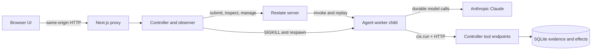

# Architecture and failure model

## Components

### Browser and Next.js

The browser owns only presentation state: selected invocation, prompt text, expanded panels, and polling. Next.js forwards `/api/control/*` to the local controller so the browser never receives Restate administration access or the controller's internal token.

### Controller

The controller is intentionally separate from the agent worker. It remains online when the worker dies and provides:

- child-process supervision and automatic restart;
- fixed Restate submission, introspection, and lifecycle operations;
- one-shot fault rules at the physical tool boundary;
- external note and calculator tools;
- an SQLite event ledger, action receipts, and idempotent tool effects;
- reconciled snapshots for the interface.

The crash endpoint can kill only the child it owns. No browser input is passed to a shell command or interpreted as a process ID.

### Agent worker

The worker exposes one Restate service, `BreakMyAgent.run`. Each prompt is an independent invocation. The Vercel AI middleware journals completed model calls; each HTTP tool call is wrapped in its own named `ctx.run` block. The entire agent loop is deliberately not hidden inside one opaque durable block.

Demo pacing requires a short public `saveNote` call first and delays tool responses. This creates a reliable interruption window without tying the agent to a business workflow or revealing private model reasoning.

### Restate

Restate owns invocation identity, scheduling, retries, pause/resume/cancel, outputs, and the durable journal. Its data lives in `.data/restate`, independent of the worker process. The controller reads `sys_invocation` and `sys_journal` through fixed introspection queries to present evidence; those queries do not drive recovery.

### SQLite

SQLite is not a workflow engine. It stores UI history and external-system facts that Restate should not fabricate: tool HTTP attempts, committed effects, fault consumption, worker exits, and command receipts. The controller is its only writer.

## Recovery sequence

1. Restate invokes `BreakMyAgent.run` on worker PID A.
2. A completed model or tool operation is appended to Restate's journal.
3. The controller sends `SIGKILL` to PID A during unfinished work.
4. Restate keeps the invocation active while the service endpoint is unavailable.
5. The supervisor starts worker PID B and the endpoint is available again.
6. Restate replays the handler. Completed durable operations return their journaled results instead of executing again.
7. The first unfinished operation resumes or retries.
8. The same invocation ID reaches a terminal result.

The event timeline combines actual process events, actual tool requests, worker observations, and Restate snapshots. It does not treat animation or browser state as recovery evidence.

## External-effect semantics

A worker can die after an external system commits a write but before Restate records the response. The request may therefore arrive again. Every tool call sends `invocationId + toolCallId` as an operation key. SQLite atomically stores that key with the result and note write. A repeat returns the stored result and increments the physical-attempt evidence without creating a second effect.

The UI reports **tool requests** separately from **unique effects**. This is more accurate than claiming that durable execution alone provides exactly-once delivery to arbitrary external systems.

## Fault ownership

| Failure | Owner | Recovery behavior |
| --- | --- | --- |
| Worker process exits | Supervisor + Restate | Supervisor restores service; Restate replays invocation |
| Tool returns 429 | Restate `ctx.run` | Retryable error honors bounded delay |
| Tool returns 500 | Restate `ctx.run` | Transient failure retries with configured backoff |
| Tool response is slow | Tool endpoint | Call remains in flight; killing worker exposes uncertainty window |
| Model provider fails | Durable AI middleware | Middleware applies its bounded call policy |
| Invocation is paused | Restate | No new work begins until resume |
| Invocation is cancelled | Restate | Cancellation is observed at runtime boundaries; effects are not undone |

AI SDK request retries are disabled for the outer generation call so retry ownership stays visible. The durable middleware has a small bounded model-call retry allowance, while tool retries are configured on each `ctx.run`.

## State and identity

The Restate invocation ID is the execution identity across UI, worker, journal, and tools. A crash and resume retain it. Restart-as-new creates a new ID and a parent link in SQLite, while the original run remains inspectable.

The controller records raw Restate status separately from a display label. “Worker offline” is infrastructure state, not an invocation outcome. “Pause requested” and “Cancelling” are transitional local labels until Restate confirms the observed lifecycle state.

## Security boundary

All services bind to localhost. The worker authenticates observation and tool requests with `CONTROLLER_INTERNAL_TOKEN`. Restate administration is reachable only from server-side code. This is suitable for a local interview demo; public deployment would require authentication, per-session authorization, rate limits, CSRF protection, tenant isolation, and a real secret store.
