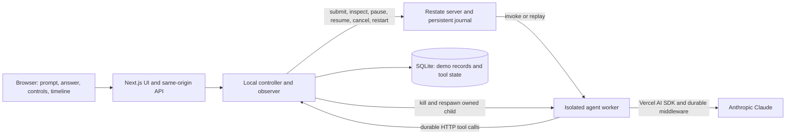

# Break My Agent — build plan

Prepared September 19, 2026. Target: an interview-ready local demo for Monday, September 21.

## 1. Product and success criteria

**Ask an AI agent anything. Interrupt its work. Watch what survives.**

The interface has a prompt box, an answer, an execution timeline, and deliberate failure controls. The underlying agent remains general-purpose. The demo teaches which responsibilities belong to the model, the agent SDK, the application's tools, and Restate.

A successful demonstration lets a viewer see all of the following:

1. A real Claude request produces tool calls and an answer.
2. The agent worker actually dies while a run is unfinished.
3. The page and controls remain available during the outage.
4. Restate resumes the same invocation when the worker returns.
5. Already-journaled work is preserved; the unfinished operation can be attempted again.
6. The visible timeline and external request records support those claims.
7. Pause, resume, cancellation, and regeneration have distinct, accurately labeled effects.
8. Refreshing the browser recovers the current run and its history.

The interview deliverables are the running app, a reproducible repository, a short recording, an architecture explanation, and specific developer-experience observations with evidence.

## 2. Current workspace and assumptions

- The working directory is empty apart from `work/` and `outputs/`. There is no application, package manifest, or existing implementation to preserve.
- Node, npm, pnpm, and Docker executables were located. Docker runtime health has not been checked. Restate executables were not found on the current command path.
- No dependencies have been installed and no application code has been written during planning.
- Default target: one presenter, one active run, on this Mac. A public multi-user deployment is a later milestone.
- Anthropic API access and a suitable model must be configured during setup. Credentials stay in local environment configuration; the browser never receives them.
- Package and server versions will be selected together and locked after the compatibility spike. Documentation availability does not prove compatibility with an arbitrary installed version.

## 3. Scope and release order

| Capability | Interview release | Follow-up |
| --- | --- | --- |
| Real Claude agent, arbitrary text prompt, bounded tool loop | Required | More providers and conversation history |
| Actual worker crash and automatic restart | Required | Per-session workers; crash Restate itself |
| Tool HTTP 429, HTTP 500, additional latency | Required | LLM endpoint faults and sustained outages |
| Pause, resume, cancel, restart from beginning | Required, verified against pinned server | Regenerate only the final answer from a journal prefix |
| Timeline, invocation ID, Restate UI link | Required | Expanded traces and shareable run reports |
| Browser refresh and reconnection | Required | Durable token streaming |
| Prompt presets and reproducible crash scenario | Required | Automated challenges and comparison mode |
| Local setup, tests, notes, recording | Required | Public hosting and reusable workshop materials |

Defer multi-agent orchestration, RAG, vector databases, user accounts, file uploads, arbitrary code execution, MCP, and web search. These can be useful extensions, but none is necessary to demonstrate the core failure and recovery behavior.

## 4. Smallest viable architecture

Use a small TypeScript workspace with three application components and a local Restate server:



### Next.js web app

Owns presentation and thin same-origin API routes. It never hosts the process that the crash button terminates. Closing a page only disconnects an observer; it does not cancel the run.

### Agent worker

A dedicated Node process hosts a plain Restate service, `BreakMyAgent.run`. It uses the Vercel AI SDK, `@ai-sdk/anthropic`, and Restate's Vercel middleware. Use a service because each prompt is an independent invocation; there is no need for a keyed, single-writer conversation or Workflow API in the first release.

Persist individual model results through `durableCalls`; wrap external tool operations individually with `ctx.run`. Do not wrap the complete agent loop in one durable block, and do not nest Restate context operations inside `ctx.run`. [Restate integration](https://docs.restate.dev/ai/sdk-integrations/vercel-ai-sdk), [durable steps](https://docs.restate.dev/develop/ts/durable-steps).

### Controller, observer, and tool service

One small Node service combines the demo-specific infrastructure:

- Starts and supervises the worker child process.
- Performs allowlisted Restate administration operations.
- Stores and consumes fault rules.
- Hosts the agent's small HTTP tool API.
- Records actual tool requests and committed tool effects.
- Collects worker observations and reconciles them with Restate status and journal data.
- Serves run snapshots and timeline pages to Next.js.

This component remains alive when the worker dies. The crash action targets only its own child process; it does not accept process IDs, shell commands, or deployment addresses from the browser.

### Restate and local persistence

Restate owns durable execution, retries, and the invocation journal. Its data directory survives worker and application restarts.

The controller is the sole SQLite writer. SQLite stores fault rules, presentation history, command receipts, and the external note tool's idempotency records. It does not schedule or resume the agent. Keeping external request evidence outside the worker makes the recovery demonstration inspectable.

Start with a project-managed local Restate binary and a single development launcher. Add a container recipe only after the local path works; do not maintain two startup systems before the interview.

## 5. Generic agent behavior

Use a small, bounded agent loop:

1. Accept the user's prompt.
2. In the default, visibly labeled **Demo pacing** mode, require an initial `save_note` tool call containing a short public task summary.
3. Let Claude choose subsequent tools or provide its answer.
4. Persist each completed model operation and each tool result separately.
5. Return the final text and recorded usage, with a clear stopped state if the step budget is exhausted.

Initial tools:

| Tool | Behavior | Why it belongs |
| --- | --- | --- |
| `save_note` | Stores a short note in the current invocation's scratchpad | Creates an observable write and idempotency example |
| `read_notes` | Reads that scratchpad | Provides a small, genuinely useful memory tool |
| `calculate` | Evaluates a bounded arithmetic expression with a safe parser | Gives the agent a useful deterministic capability |

The note is an intentional user-facing progress summary, not a request for private chain-of-thought. Do not expose hidden reasoning in the timeline.

Demo pacing adds a clearly labeled delay to tool requests and creates a reliable window for interference, even for short prompts. A normal mode removes the mandatory first note and pacing. Do not fabricate extra research or pretend a calculation is a network lookup.

Candidate presets:

- “Compare fixed-window, sliding-window, and token-bucket rate limiting. Calculate requests per minute at 12 requests per second and recommend an approach.”
- “Write a short launch announcement for a developer tool and give me three different headlines.”
- “Write a limerick about distributed systems.”

No live web access in version one. The UI should describe the available tools, and the agent should acknowledge when a request needs fresh information it cannot retrieve.

Initial configurable limits: one active run, six model steps, 6,000 prompt characters, and a modest per-generation output cap. Select and verify the actual Claude model during setup; expose the configured model name. Prefer sequential tool calls for a readable timeline. The Anthropic provider supports model selection and disabling parallel tool use. [Anthropic provider](https://ai-sdk.dev/providers/ai-sdk-providers/anthropic), [AI SDK tool calling](https://ai-sdk.dev/docs/ai-sdk-core/tools-and-tool-calling).

## 6. Exact semantics of the controls

| Control | Implementation | Visible result and acceptance condition |
| --- | --- | --- |
| **Crash worker** | Controller sends `SIGKILL` to its owned worker, waits a short configured interval, and starts a new child | Old PID exits; new PID appears; UI stays usable; same invocation completes after recovery |
| **Inject 429** | Tool service consumes a one-shot rule and returns a real 429 with `Retry-After` | Target operation fails, a retry wait is visible, and a later attempt succeeds |
| **Inject 500** | Tool service consumes a one-shot rule and returns a real HTTP 500 | The unfinished durable step retries without restarting completed work |
| **Add 10s latency** | Tool service delays the next matching HTTP response | A clearly labeled delayed operation appears; the worker can be crashed while waiting |
| **Pause** | Controller calls Restate's pause endpoint | UI first says “Pause requested,” then shows the observed paused state |
| **Resume** | Controller calls Restate's resume endpoint | Existing invocation continues; its ID remains unchanged |
| **Cancel** | Controller requests cooperative cancellation | UI shows “Cancelling” until confirmed terminal; no subsequent planned steps run |
| **Restart / regenerate** | For a completed invocation, call restart-as-new from the beginning | New invocation ID, fresh execution, preserved old run, visible parent link |

Pause/resume/cancel are Restate administrative actions, not front-end state changes. Their transitions must be confirmed by observing runtime state. Cancellation may wait for the service to be reachable and for current work to reach a cancellation boundary. It does not undo external effects automatically. [Managing invocations](https://docs.restate.dev/services/invocation/managing-invocations).

“Crash worker” must never call Restate's **kill invocation** API. A crashed worker can recover an invocation; killing an invocation is a different operation.

For restart while running, first cancel and wait for terminal completion, then start the new invocation. The first UI can enable restart only on terminal runs to keep this unambiguous. If cancellation races with completion, reconcile the final state before proceeding.

Restate's restart API supports preserving a completed journal prefix. Keep **regenerate only the final answer** as a follow-up: identify a supported boundary, verify the retained prefix has completed commands, and maintain distinct old/new histories. A full restart reruns tools and can incur new API usage. [Restart API](https://docs.restate.dev/admin-api/invocation/restart-invocation-as-new).

### Fault rules and retries

Each rule has an ID, invocation ID, target, kind, remaining count, creation order, and expiry. Begin with one pending fault per run; show **Armed → Applied** or **Unused / expired**. Disable injection when the run is terminal. A fault always targets the next matching request unless a deterministic scenario explicitly arms a future operation.

Consume fault rules transactionally in the external tool service on each real HTTP attempt. Do not journal a one-time “inject failure” decision before the call and replay that decision forever. Already-journaled steps will not reach the tool service and therefore will not consume a rule.

Explicitly inspect non-success HTTP responses: a resolved `fetch` returning 500 is not itself a thrown exception. Translate 429 into a retryable error with bounded `Retry-After`; translate 500 into a transient failure; reject invalid inputs as terminal.

Give retry ownership to Restate. Disable AI SDK request retries where supported, inspect middleware behavior, and test that one injected failure produces the expected number of transport attempts. Configure bounded run-level retries and a deliberate invocation retry policy; keep worker outages recoverable. Restate documents a retryable error with custom delay, and distinguishes invocation retry exhaustion from run-block terminal failure. [Error handling](https://docs.restate.dev/guides/error-handling).

A tool exception must not accidentally become an ordinary model-visible result that lets the SDK continue after cancellation or terminal failure. Test that behavior against the pinned SDK; adapt the tool loop if necessary.

## 7. Durability claims and evidence

The primary demonstration is **preservation of completed, journaled work**. Avoid a universal “exactly one HTTP request” or “zero duplicated tool calls” promise.

There is an uncertainty window when an external system finishes work but the worker dies before Restate records the result. The external request can happen again. For the note tool, implement stable idempotency keys and atomically commit the key, stored result, and note write. Count requests separately from committed effects. [Restate database integration](https://docs.restate.dev/guides/databases).

Use `invocationId + stableToolCallId` as the logical operation key. A retry reuses it; a full regeneration receives a new invocation ID and therefore a new key. Model-call instrumentation should likewise use stable logical step IDs. Confirm available identifiers during the first implementation spike.

Do not claim an interrupted Claude call cannot be billed or repeated. Present provider request observations and returned token usage; missing usage after interruption is **unknown**, not zero. Journaling a completed result prevents repeating that completed operation during ordinary replay, subject to tested compatibility and retention.

The controller should expose:

- Actual worker exits and process restarts.
- Restate invocation identity, lifecycle, and completed journal entries.
- Actual HTTP attempts received by the tool service.
- Unique note effects and requests deduplicated by the note tool.
- Recovery time, measured from worker exit to observed resumed progress.
- Which previous checkpoints remained available after the failure.

In the UI, a tool HTTP success is initially **response received**. Only confirmed journal information can make it **saved checkpoint**. Recovery animations must follow evidence. If replay itself is inferred from preserved journal entries and subsequent progress, label that inference in the expanded details.

## 8. Timeline and state model

### Sources of truth

- **Restate:** invocation outcome and durable journal.
- **Controller:** worker lifecycle, commands, fault consumption, external tool requests/effects.
- **Worker observations:** step labels, provider requests, usage, and attempt context.
- **Browser:** current selection, expanded panels, and connection status only.

Query Restate through a small server-side adapter over its introspection API. Validate IDs, issue fixed query shapes, and translate the pinned server's schema into application types. Restate exposes invocation and journal tables for this purpose. [Introspection](https://docs.restate.dev/services/introspection), [schema reference](https://docs.restate.dev/references/sql-introspection).

Use available SDK hooks for attempt observations. Restate documents that handler hooks run per attempt, whereas a run hook is skipped when its completed result is replayed. Treat telemetry as observation, never as the mechanism that recovers execution. [TypeScript hooks](https://docs.restate.dev/develop/ts/hooks).

### Records

| Record | Key fields |
| --- | --- |
| Submission | Client request ID, immutable prompt/config hash, acceptance status, resolved invocation ID |
| Run | Invocation ID, optional parent invocation ID, prompt/config, raw Restate state, displayed state, outcome, timestamps |
| Step | Invocation ID, logical step ID, name/type, journal entry mapping, completion status |
| Attempt | Step ID, observation ID, worker boot ID, start/end, response status, uncertainty marker |
| Fault | Fault ID, invocation ID, target, remaining count, expiry, consumed attempt |
| Command | Client action ID, invocation ID, action, requested/acknowledged/confirmed timestamps, result |
| Event | Monotonic sequence, observation time, source, source event ID, run/step/attempt IDs, kind, bounded payload |
| Tool effect | Invocation-scoped operation key, request fingerprint, committed output |

Store raw lifecycle states separately from user-facing labels. Suggested labels: queued, running, retrying, waiting, pause requested, paused, recovering, cancelling, completed, cancelled, failed. “Worker offline” and “Browser disconnected” are separate indicators, not invocation outcomes. Runtime completion must be combined with the returned outcome to distinguish success from cancellation or failure.

Deduplicate observations using stable source IDs. Preserve physical attempt events separately from logical step cards. Reconcile snapshots after reconnect and controller restart. Polling can miss brief transitions; mark unavailable attempt details honestly and avoid deriving exact counts from snapshots alone.

## 9. API and identity contracts

The browser talks only to Next.js. Suggested application routes:

| Route | Contract |
| --- | --- |
| `POST /api/runs` | Validate prompt/config; accept a client request ID; return acceptance and invocation ID |
| `GET /api/runs/:id` | Return reconciled status, steps, metrics, latest event cursor, and available controls |
| `GET /api/runs/:id/events?after=...` | Return ordered, paginated timeline observations |
| `GET /api/runs/:id/output` | Return pending, final answer, or terminal error without starting another run |
| `POST /api/runs/:id/faults` | Arm a validated fault for the selected invocation |
| `POST /api/runs/:id/actions` | Accept an action ID and a permitted pause/resume/cancel/restart action |
| `POST /api/worker/crash` | Crash the owned worker for the active demo run |
| `GET /api/health` | Report web/controller/worker/Restate readiness and configuration status |

Submission is asynchronous and uses an explicit Restate idempotency key. Retrying an ambiguous submission reuses that key and the same input. Different input with the same client request ID returns a conflict. Restate's HTTP API provides asynchronous acceptance, output retrieval, and lookup by idempotency target. Pin the API version because ingress route formats differ across server generations. [Invocation HTTP API](https://docs.restate.dev/services/invocation/http).

Use the actual invocation ID as the execution identity, including inside the worker. Do not rely on an application run ID embedded in the original input to distinguish regenerated runs: restart-as-new reuses that input. The controller records parent-child relationships separately and tolerates the new worker starting before the restart response is processed.

Action IDs prevent duplicate button submissions locally. An ambiguous restart-as-new response is especially important: do not blindly repeat it, since the operation creates another invocation. Record the pending action, reconcile any new invocation using available metadata, and show an uncertain outcome if it cannot be established safely.

Configure result and journal retention to cover the complete interview and rehearsal period, for example seven days locally. Test that completed runs remain inspectable and restartable for that period.

## 10. Polished interface

Build a compact instrument-panel aesthetic: neutral dark surfaces, readable typography, one primary accent, amber for interruption, and green for confirmed recovery. Reserve red for destructive controls or real errors. The page should feel playful without hiding what happened.

Desktop layout:

1. **Header:** Break My Agent, one-line explanation, real-model label, runtime health.
2. **Prompt and answer area:** prompt presets, run button, answer, copy action, recent runs.
3. **Execution area:** semantic step cards and expandable attempt details.
4. **Control area:** prominent crash button, fault buttons, separate lifecycle actions.
5. **Evidence footer:** invocation ID with copy, Restate UI link, worker state, measured recovery facts.

During a crash, keep existing checkpoints visible and show the worker outage explicitly. When progress resumes, highlight the first confirmed new progress and preserve the same invocation ID on screen.

Example summary: “Worker recovered. 3 saved checkpoints preserved. 1 tool request retried.” Populate each number only from recorded evidence. Do not report cancellation as “agent survived.”

Implement keyboard access, clear disabled states, reduced-motion support, readable contrast, and a stacked mobile layout. Avoid constantly announcing every log line to screen readers. Show useful setup states for missing key, unavailable Restate, unavailable worker, provider refusal, invalid model, timeout, and expired history.

Begin with approximately 750 ms snapshot/event polling while a run is active, slowing down when inactive. Recover using a cursor and a fresh snapshot. This is a live event timeline, not token streaming. Restate offers an SSE/pubsub integration if we later need push updates. [Streaming responses](https://docs.restate.dev/ai/patterns/streaming-responses).

## 11. Suggested repository layout

```text
apps/
  web/                 Next.js interface and server-side route adapters
  worker/              Restate service, agent configuration, tool adapters
  controller/          Child supervision, faults, tools, SQLite, observation
packages/
  contracts/           Shared schemas and event/control types
scripts/
  dev.ts               Start, health-check, register, and stop local services
  doctor.ts            Validate environment and compatible runtime versions
tests/
  integration/         Real Restate recovery and lifecycle tests
  e2e/                 Browser interactions and reconnection
docs/
  architecture.md
  demo-script.md
  dx-notes.md
  compatibility.md
restate.toml
.env.example
pnpm-workspace.yaml
README.md
```

The official Next.js example is a reference for integration details, not a reason to put the killable worker in the web server. Record the source revision and preserve relevant attribution if code is copied. [Official template](https://github.com/restatedev/ai-examples/tree/main/vercel-ai/nextjs-template).

## 12. Build milestones

Effort estimates are planning ranges, not delivery guarantees. The complete interview release is roughly 18–26 focused engineering hours, with overlap possible after the first integration gate. If time is tight, finish the verified crash demonstration before adding more controls.

### Milestone 0 — compatibility and recovery spike, 2–3 hours

- Select a compatible Node/Next/AI SDK/Anthropic/Restate middleware/server combination; record exact versions.
- Start Restate with persistent storage and a separate worker; register the service.
- Submit a real prompt using an explicit idempotency key; retrieve its invocation ID and answer.
- Force one useful tool call, delay its response, kill the worker, and restart it.
- Inspect the same invocation and completed journal entries after recovery.
- Probe pause/resume/cancel/restart, hook availability, retention, and error propagation.

**Exit gate:** terminal-level evidence that a real Claude + tool invocation survives an actual worker crash. Resolve blocking compatibility issues here before building around assumed APIs.

### Milestone 1 — execution and control foundation, 3–4 hours

- Scaffold the workspace, shared schemas, environment validation, and launcher.
- Implement the controller, SQLite records, owned-child supervision, and health checks.
- Implement asynchronous submission, idempotent acceptance recovery, status, output, and run history.
- Implement the generic tools and stable operation keys.

**Exit gate:** start everything with one command; submit and inspect runs through application APIs; refresh cannot accidentally resubmit work.

### Milestone 2 — complete crash demonstration, 4–5 hours

- Build the prompt/answer layout and live step timeline.
- Implement the crash button, real worker lifecycle events, recovery reconciliation, and evidence footer.
- Add a reproducible scenario that crashes during a delayed tool after a confirmed checkpoint.
- Add browser refresh/reconnect behavior and essential error states.

**Exit gate:** rehearse a complete prompt → checkpoint → crash → recovery → answer sequence from the UI. This is the first interview-usable version.

### Milestone 3 — remaining controls, 3–4 hours

- Add fault rules, real HTTP 429/500 responses, latency, and visible armed/applied status.
- Add pause/resume/cancel and full restart-as-new with confirmed lifecycle transitions.
- Verify retry ownership, bounded errors, cancellation behavior, and distinct restart identity.
- Handle commands sent during worker downtime and state-change races.

**Exit gate:** each control passes its acceptance scenario independently and in selected combinations.

### Milestone 4 — visual polish and reliability, 4–6 hours

- Finish responsive layout, animation, accessibility, answer rendering, and useful empty/error states.
- Add integration tests and browser checks for the guarantees listed below.
- Validate local startup from a clean checkout and a fresh Restate data directory.
- Record live-model smoke runs and fix blocking failures; freeze versions afterward.

**Exit gate:** five consecutive rehearsals of the core crash scenario with accurate timeline evidence, plus the lifecycle/fault matrix passing.

### Milestone 5 — interview package, 2–4 hours

- Write the short explanation, startup guide, known limitations, and architecture diagram.
- Capture a two-minute recording and backup screenshots of a real run.
- Curate three to five developer-experience observations with minimal reproductions.
- Rehearse a 90-second version and a five-minute version.

**Exit gate:** the demo can be presented locally, explained clearly, and shown from the recording if network or API availability fails.

Suggested schedule: Saturday, establish the recovery spike and core UI; Sunday, finish controls, test, polish, and record; Monday, run readiness checks and rehearse without dependency upgrades.

## 13. Verification matrix

Use real Restate for integration tests. A deterministic test model/provider avoids repeated API spend, but it must be labeled as a test fixture and must never stand in for the real-model interview run.

| Test | Required observation |
| --- | --- |
| Happy path | Actual Claude output, tool activity, final persisted result |
| Duplicate submission | Same request key and input resolve to one invocation |
| Crash after checkpoint | Same invocation resumes; earlier confirmed steps are preserved |
| Crash during unjournaled tool | Unfinished request may retry; unique note effect remains one |
| Crash after effect before response | Repeated HTTP request returns the stored idempotent result |
| 429 | One injected response, observed delay, successful retry under the configured owner |
| 500 | Failed attempt and successful retry without redoing prior checkpoints |
| Latency plus crash | Pending operation remains understandable and eventually completes |
| Pause/resume | Confirmed paused state; same invocation resumes; no assertion that an already-sent provider request was undone |
| Cancel during a tool/model operation | Cancellation reaches terminal state; no later intended step starts |
| Cancel while worker is offline | UI remains cancelling until runtime confirms the outcome |
| Regenerate | New invocation; old result untouched; no inherited fault rules or conflicting tool keys |
| Ambiguous control response | UI reconciles state; restart is not blindly submitted twice |
| Refresh/reconnect | Current run, existing events, and output return without starting a new invocation |
| Controller restart | Saved observations return and current state reconciles with Restate |
| Invalid credentials/model or input | Bounded, actionable failure instead of endless retries |
| Repeated crash clicks | Only the owned worker is affected; supervisor cannot spawn duplicates |
| Retention and expiry | Old runs either remain usable or show an explicit expired state |

Use targeted unit tests for fault consumption, command deduplication, tool idempotency, and lifecycle mapping where these encode real failure behavior. Use browser tests for controls, reconnection, and visible state. Do not rely on screenshots alone to validate durability.

## 14. Local operations and public hosting

The local launcher should validate configuration, start Restate, start the controller/worker, register the service, and start Next.js. It should report conflicting ports, preserve data on ordinary shutdown, and stop only the processes it owns. Provide an explicit reset command for disposable demo data.

Keep the controller and Restate admin endpoints private. Validate same-origin browser actions, use a server-side controller token, scope actions to the selected demo invocation, and bound prompt/output/fault sizes. These controls are directly relevant because the app deliberately exposes worker termination and paid model use.

Do not change worker code under active runs during rehearsal; replay compatibility is part of the demonstration. Freeze the service build and versions before recording.

A future public deployment should keep the same process separation on a host that supports a supervised worker and persistent Restate storage, or use managed Restate plus a separately hosted worker/controller. Add access control, API spend limits, and per-session isolation before allowing arbitrary visitors to crash workers. Static hosting or a serverless Next.js deployment alone does not provide this entire topology.

## 15. Interview demonstration

1. **0:00–0:20:** Explain the prompt box and show the available tools. Submit the rate-limiting preset.
2. **0:20–0:40:** Point out the invocation ID and a confirmed completed checkpoint.
3. **0:40–1:10:** Crash the worker during a delayed tool. Keep the answer area and previous checkpoints visible while the worker is offline.
4. **1:10–1:40:** Show the new worker process and resumed progress under the same invocation ID. Explain which operation was retried and which checkpoints were preserved.
5. **1:40–2:00:** Open the corresponding Restate invocation and show the final answer.

For a longer demonstration, inject 429 on another run, then show pause/resume and a full regeneration with a new invocation ID.

The technical explanation should connect the parts: Claude chooses what to do; the AI SDK manages model/tool interactions; Restate journals progress and coordinates recovery; the process supervisor brings the worker back; the external tool handles its own idempotent effects.

Discuss the most useful boundary honestly: preserving completed results is different from making every external side effect exactly-once without cooperation.

## 16. Developer-experience notes and unresolved checks

Keep a running log during each milestone, with versions, expected behavior, actual behavior, reproduction, time lost, workaround, and a suggested improvement. Distinguish observed friction from questions and hypotheses.

Initial checks to resolve:

- Compatible versions of the server, SDK, middleware, AI SDK, and Anthropic provider.
- Whether the selected middleware's error mapping preserves the intended retry and cancellation behavior.
- Journal and hook information available for naming model steps and associating physical attempts.
- Pause behavior during an in-flight model/tool request and how it appears in introspection.
- Precise restart boundary semantics and behavior if its HTTP response is lost.
- Completed invocation retention and Restate UI deep-link format.
- Whether polling provides sufficient presentation quality; add SSE only if measured need justifies it.

Early research findings are recorded separately in `break-my-agent-dx-notes.md`. No Restate runtime defects have been established at this planning stage.
